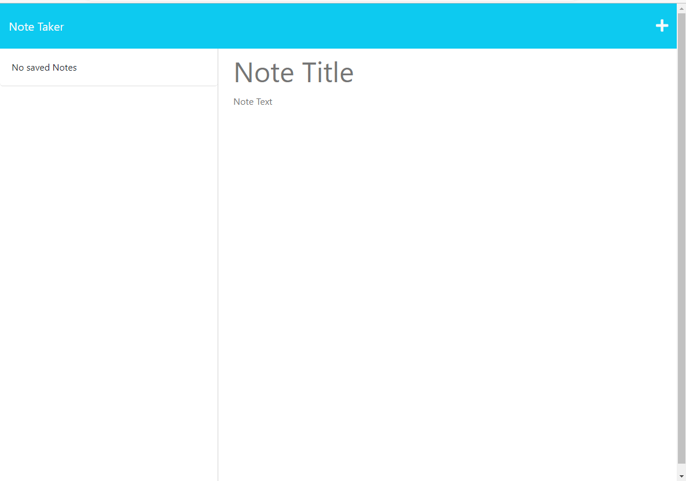
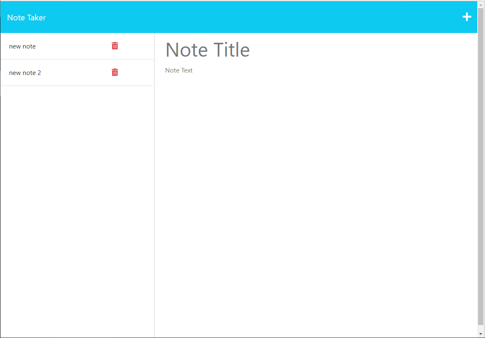
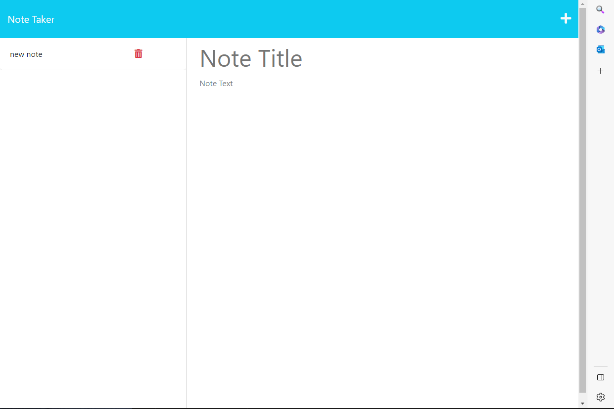

## Author

Devin Nunez

Email: devv-nunn@gmail.com
git: https://github.com/devv-nunn

## Description

In this project create a note taker application that adds and deletes notes.

This functionality will be added using express.js that will be handling our page routes and data storage

The main page will contain a button that will then take you to our note page which is done with express get and res.getfile functin and method. 

The functionality of adding and deleting notes is also done by implementing express.js to handle the back-end along with node.js to handle front-end requests.

Data is then stored into a local json file. Also implemented using express/node.js.

## Table of Contents (Optional)

N/a

## Installation

- vs.code and node.js must be installed to use this applicationn

- after vs.code is installed you must install promisify.

- Clone the following repository after installing vs.code and node.js and run index.html in integrated terminal.

## Usage

To use this application run npm start to run the server. After going to localhost you will be presenting with a main page that allows users to got to the note page with a click of a button. the routes are created using express.js. After going to the note page you are allowed to add and delete notes. This is done by creating an express server that saves data into a local json database. this is done by using various express methods and routes.

## Videos Demonstrating application:

N/a

## Deployment

https://pacific-retreat-49134.herokuapp.com/

# Tech Stack

JavaScript
node.js
Express.js

## Credits

N/a

## License

MIT License.